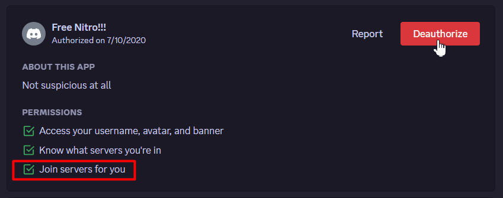

# Why is Invite Tracker inviting me to servers?

Invite Tracker **does not** add you to servers **nor** does it randomly DM you messages.

You are receiving a "Join DM" because the server your account joined setup the bot to send the message.

If you did not join the server, you need to secure your account. Go to your **User Settings** -> **Authorized Apps**. You will want to look for any applications that contain "Join servers for you" and **Deauthorize** them.

<figure><figcaption></figcaption></figure>

Please read through the following Discord article if your account was [hacked or compromised.](https://support.discord.com/hc/en-us/articles/24160905919511-My-Discord-Account-was-Hacked-or-Compromised) It also contains tips on how to secure your account.
