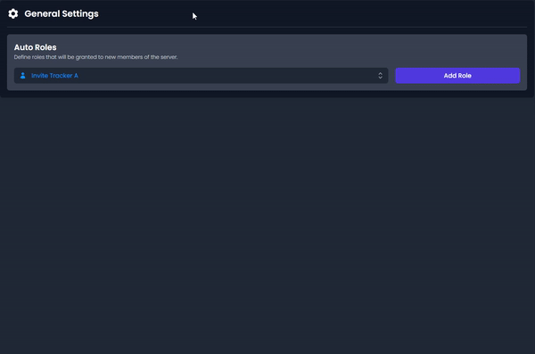

# ⚙️ Administration

## Auto Roles

Automatic roles are automatically assigned to every new member.


<mark style="color:$success;">An auto role could be something like a member role.</mark>



<mark style="color:$info;">Free servers can only have a maximum of 3 auto roles.</mark>

<mark style="color:$info;">Premium servers can have an unlimited amount of auto roles.</mark>



<mark style="color:$warning;">When configuring Auto Roles in your server, make sure the Invite Tracker bot role is above the role you want to give.</mark>

