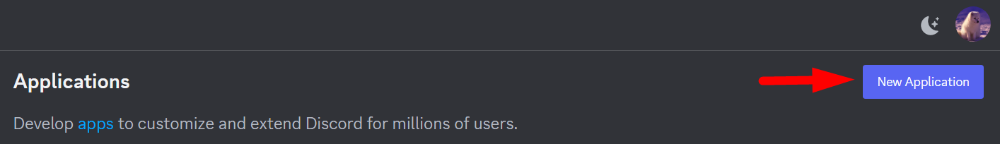
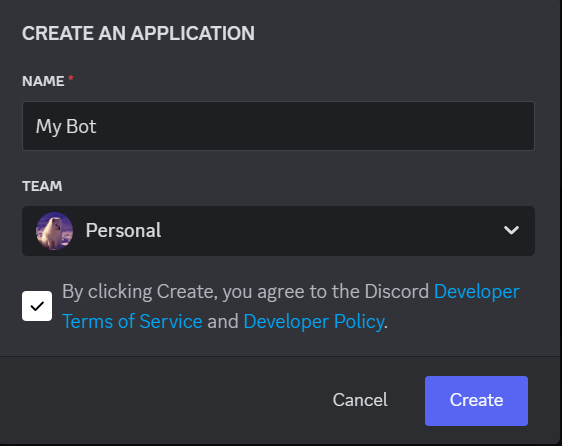
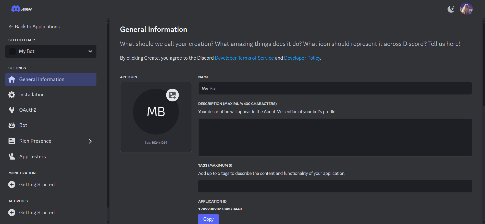
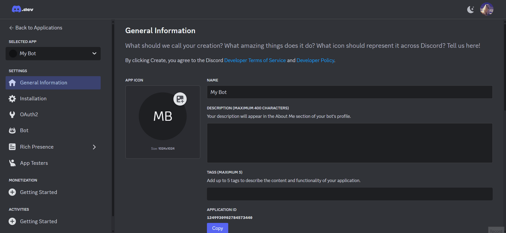
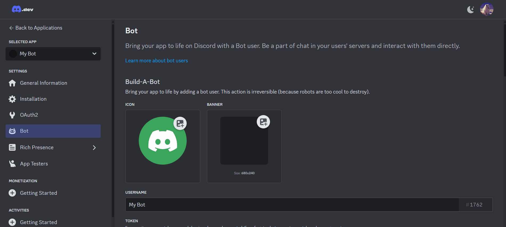
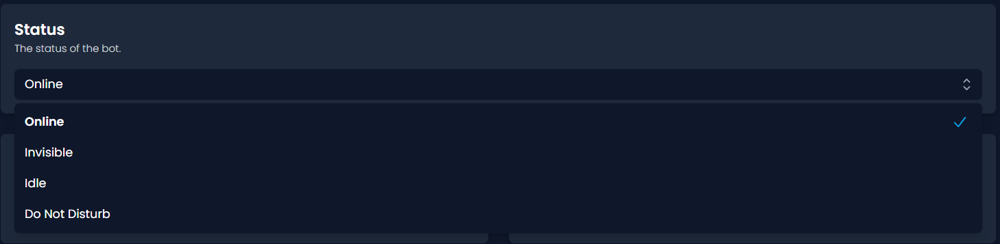
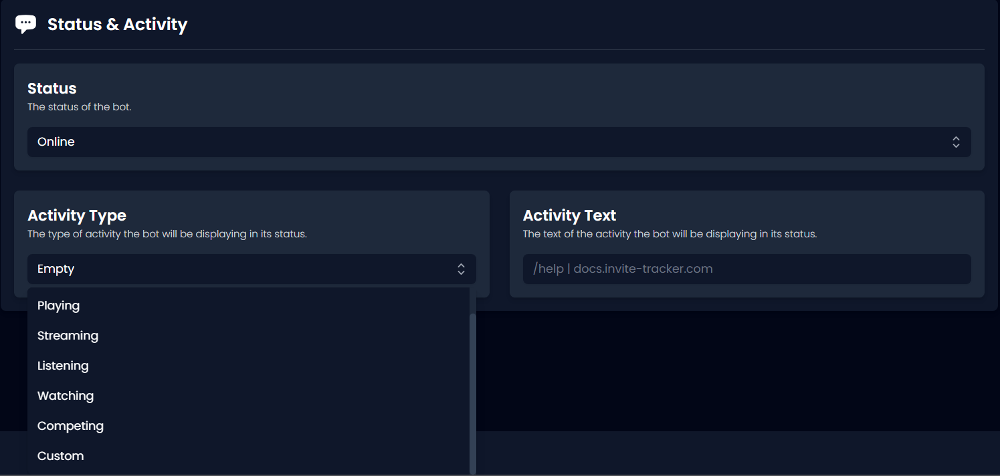

# 🤖 Custom Bot


This feature requires the **Custom Bot** tier of Invite Tracker Premium. You can purchase it [here](https://invite-tracker.com/premium) and read about all it's perks.


If you have the applicable subscription already, let's get started with making an application for Invite Tracker to run on. You may [skip](custom-bot.md#embed-color) this part if you already know what you're doing.

## Creating an Application

Let's start by heading over to the [Discord Developer Portal](https://discord.com/developers/applications). Make sure you're logged into the desired account and click the button _**New Application**_ at the top right of the page below your avatar.

<figure><figcaption></figcaption></figure>

Choose a name for your new application and agree to the terms and conditions. After, click _**Create**_.\

<figure><figcaption></figcaption></figure>

Head to the Bot tab on the left. From there, disable the _**Public Bot**_ option and enable the _**Server Members Intent**_ option.

<figure><figcaption></figcaption></figure>


The custom bot will not work without the _**Server Members Intent**_ option.


To invite the custom bot to your server, head to the OAuth2 tab on the left. Select _**bot**_ in OAuth2 URL Generator and _**Administrator**_ in Bot Permissions. You will then be able to use the Generated URL to invite your custom bot to the server.

<figure><figcaption></figcaption></figure>


For this tutorial, administrator allows the custom bot to function as efficiently as possible. You may still choose to use the default Invite Tracker permissions. Click [here](../../faq.md#what-are-the-required-permissions-for-invite-tracker) to see them.


After inviting your custom bot, we need to activate it. Head to the Bot tab on the left and copy your token. On the server with the Custom bot tier, you will see a new plugin called _**Custom Bot**_, then paste the copied token into _**Bot Token**_ and save changes.

<figure><figcaption></figcaption></figure>

## Embed Color

Customize the embed color sent by the custom bot with the color picker.

<figure><figcaption></figcaption></figure>

## Status & Activity

You will be able to customize the custom bot's status and activity status as well.

There are 4 statuses you can choose from:

* Online
* Invisible
* Idle
* Do Not Disturb

<figure><figcaption></figcaption></figure>

There are a variety of activity types you may choose from along with being able to customize the text that displays after the type.

<figure><figcaption></figcaption></figure>
