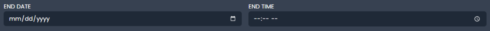
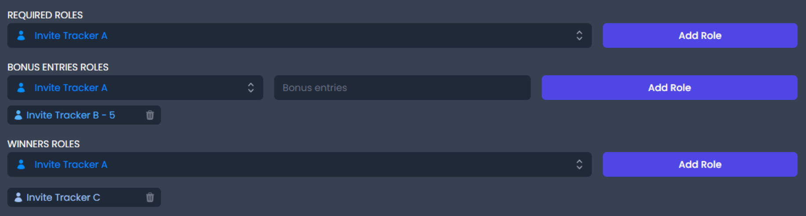
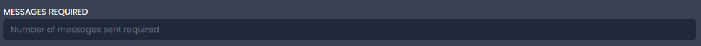

# 🎉 Giveaways


<mark style="color:orange;">Free servers can only have a maximum of 5 running giveaways at the same time.</mark>

<mark style="color:orange;">Premium servers can have up to 50 running giveaways at the same time.</mark>


## Giveaway Roles

* **Giveaway Blacklisted Roles** are roles that disallow any user with any of these roles from joining any giveaways.
* **Giveaway Bypass Roles** are roles that allow any user with any of these roles to join any giveaway even if they do not meet the requirements.


<mark style="color:orange;">Free servers can only have a maximum of 5 giveaway-blacklisted roles and 5 giveaway bypass roles.</mark>

<mark style="color:orange;">Premium servers can have an unlimited amount of giveaway-blacklisted roles and giveaway bypass roles.</mark>


## Creating a Giveaway

To start creating a giveaway, simply click the big blue button that says _**Create Giveaway**_. This will make another menu pop up.

At first glance, it might look like a lot of very complicated stuff but do not worry. We will go through everything.

### Prize Name, Number of Winners, and Channel

* **Prize Name** is what you want to call your giveaway. We recommend you include the prize of the giveaway in the name.
* **Number of Winners** is where you insert how many winners you want for your giveaway. Invite Tracker will select the specified amount of winners when the giveaway ends.
* **Channel** is where you configure which channel you want the giveaway to be sent in. Simply click the box and choose the channel.

.png>)


<mark style="color:orange;">The maximum length of your prize name is only 190 characters.</mark>

<mark style="color:orange;">The maximum amount of winners you can have without premium is 20 and with premium is 100.</mark>


### End Date

The first box under **End Date** is where you configure what day you want the giveaway to end. The format, as shown in the box, is `mm/dd/yyyy`. You can also click the little calendar icon on the right side of the box to display an interactive calendar which you can use to choose the day you want the giveaway to end.

The second box is where you configure at what time you want the giveaway to end. It uses a 24-hour clock format. You can also click the little clock icon on the right side of the box to display an interactive time selector which you can use to choose the time you want the giveaway to end.


<mark style="color:blue;">The giveaway ends at the configured time in your time zone.</mark>


### Role Assignment

* **Required Roles** are roles that are needed to join a giveaway. If you do not have all the required roles and you try to join the giveaway, you will not be able to enter.
* **Bonus Entry Roles** are all awarded a specified amount of bonus entries to the giveaway. Users with these roles have an increased chance of winning the giveaway.
*  **Winner Roles** are roles that are given to the winner(s) of the giveaway.


<mark style="color:orange;">Remember to add the number of bonus entries given to each role when assigning bonus entry roles.</mark>



<mark style="color:orange;">The maximum amount of required roles, bonus entry roles, and winner roles you can have is 10.</mark>


### Required Messages

Required messages are pretty self-explanatory. In order to join the giveaway, you have to have the required number of messages sent in the server.


<mark style="color:orange;">Only numbers can go here to set the number of messages you want to require to be able to enter the giveaway. If the number of messages required is not met it will not allow you to enter the giveaway.</mark>


### An example of a Giveaway

Below is an example of what the giveaway creation process will look like. In this giveaway, the "Member" role is required to enter. The "Invite Tracker B" role is set to have 25 bonus entries if the user has that role and the "Invite Tracker A" role will be awarded to the winner of the giveaway. Lastly, the number of messages required to enter the giveaway is 15.

Now we just hit the blue button at the bottom of the page named **Create giveaway** and the giveaway should be made in the configured channel. If not, check Invite Tracker's permissions first.

.png>)

Now that we have an active giveaway, we can go back to the dashboard and see that it has been added to the list of the server's active giveaways.

##  Editing a Giveaway

To edit a giveaway, just click the _**Blue Pencil**_ button. This will show almost the exact same menu as the giveaway creation menu.

From here you can edit anything you like and after you save, Invite Tracker will make the necessary changes to the giveaway in the server.

For our giveaway, we will increase the required number of messages up to 50 from 15.

Now you can just go ahead and click _**Edit giveaway**_. Now if you check your server, you will be able to see that the giveaway has changed.

