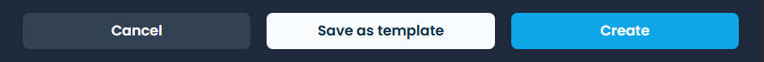

# 🎉 Giveaways


A tutorial video on how giveaways work and how to set them up.



<mark style="color:$warning;">Free servers can only have a maximum of 5 running giveaways at the same time.</mark>

<mark style="color:$warning;">Premium servers can have up to 50 running giveaways at the same time.</mark>


## Creating a Giveaway

To start creating a giveaway, simply click the big blue button that says _**New**_. This will make another menu pop up.

<figure><figcaption></figcaption></figure>

At first glance, it might look like a lot of very complicated stuff but do not worry. We will go through everything.

### Base Template

You can select a giveaway template to auto fill in the prize name, number of winners, required roles, messages required, bonus entry roles and roles granted to winners. When using a template however you must input the **End Date and Time** and also select the giveaway channel before creating the giveaway.

<figure><figcaption></figcaption></figure>

### Prize Name, Number of Winners, and Channel

* **Prize Name** is what you want to call your giveaway. We recommend you include the prize of the giveaway in the name.
* **Number of Winners** is where you insert how many winners you want for your giveaway. Invite Tracker will select the specified amount of winners when the giveaway ends.
* **Channel** is where you configure which channel you want the giveaway to be sent in. Simply click the box and choose the channel.


<mark style="color:$warning;">The maximum length of your prize name is only 190 characters.</mark>

<mark style="color:$warning;">The maximum amount of winners you can have without premium is 20 and with premium is 100.</mark>


### End Date

The first box under **End Date** is where you configure what day you want the giveaway to end. The format, as shown in the box, is `yyyy/mm/dd`. You can also click the little calendar icon on the right side of the box to display an interactive calendar which you can use to choose the day you want the giveaway to end.

The second box is where you configure at what time you want the giveaway to end. It uses a 24-hour clock format. You can also click the little clock icon on the right side of the box to display an interactive time selector which you can use to choose the time you want the giveaway to end.

<figure><figcaption></figcaption></figure>


<mark style="color:$info;">The giveaway ends at the configured time in your time zone.</mark>



<mark style="color:$warning;">The maximum end date without premium is 1 month and with premium is 3 months.</mark>


### Required Roles

Required Roles allows you to choose between "All roles required" versus "Only one role required" meaning the user needs to have all the roles selected or just one of the roles.

<figure><figcaption></figcaption></figure>


<mark style="color:$warning;">The maximum amount of required roles you can have is 10.</mark>


### Required Messages

Required messages are pretty self-explanatory. In order to join the giveaway, you need to have the required number of messages sent in the server.


<mark style="color:$warning;">Only numbers can go here to set the number of messages you want to require to be able to enter the giveaway.</mark> \ <mark style="color:$warning;">If the number of messages required is not met, it will not allow you to enter the giveaway.</mark>


### Bonus Entry Roles and Roles Granted To Winners

**Bonus Entry Roles** are all awarded a specified amount of bonus entries to the giveaway. Users with these roles have an increased chance of winning the giveaway.

 **Roles Granted To Winners** are roles that are granted to the winner(s) of the giveaway.

<figure><figcaption></figcaption></figure>


<mark style="color:$warning;">Remember to add the number of bonus entries given to each role when assigning bonus entry roles.</mark>



<mark style="color:$warning;">The maximum amount of bonus entry roles and roles granted to winners you can have is 10 and with premium you may have up to 30 bonus entry roles.</mark>


### An example of a Giveaway

Below is an example of what the giveaway creation process will look like. In this giveaway, both "Verified" and "Role 1" roles are required to enter. The number of messages required to enter the giveaway is 50. The "Server Booster" role is set to have 5 bonus entries if the user has that role and the "Reward A" role will be awarded to the winner of the giveaway (Winner roles are a premium feature).

<figure><figcaption></figcaption></figure>

Now we just hit the blue button at the bottom of the page named **Create giveaway** and the giveaway should be made in the configured channel. If not, check [Invite Tracker's permissions](../../faq.md#what-are-the-required-permissions-for-invite-tracker) first.

<figure><figcaption></figcaption></figure>

Now that we have an active giveaway, we can go back to the dashboard and see that it has been added to the list of the server's active giveaways.

<figure><figcaption></figcaption></figure>

## Scheduling a Giveaway

To schedule a giveaway, click the **Schedule** button and fill in the [giveaway details](giveaways.md#creating-a-giveaway) from above.

<figure><figcaption></figcaption></figure>

Unlike creating a normal giveaway on the dashboard, when you schedule a giveaway, you will set a starting date and a duration.


<mark style="color:$warning;">Free servers can only have 1 giveaway scheduled at a time.</mark>

<mark style="color:$warning;">Premium servers can schedule an unlimited amount of giveaways.</mark>


### Repeating a Giveaway&#x20;

If you would like to make your scheduled giveaway repeat, turn on the **Repeating** switch and you can select how often it should run.

<figure><figcaption>
This scheduled giveaway for example would repeat every week on Monday at 10:00am.
</figcaption></figure>


<mark style="color:$info;">The scheduled giveaway repeats at the configured time in your time zone.</mark>


##  Editing a Giveaway

To edit a giveaway, just click the _**Blue Pencil**_ button. This will show almost the exact same menu as the giveaway creation menu.

<figure><figcaption></figcaption></figure>

From here you can edit anything you like and after you save, Invite Tracker will make the necessary changes to the giveaway in the server.

For our giveaway, we will increase the required number of messages up to 100 from 50.

Now you can just go ahead and click _**Edit giveaway**_. Now if you check your server, you will be able to see that the giveaway has changed.

<figure><figcaption></figcaption></figure>

## Rerolling a Giveaway

To reroll an ended giveaway, just click the _**Blue Present**_ button. This will open a menu to allow you to select the number of winners to reroll.

<figure><figcaption></figcaption></figure>

## Giveaway Roles

* **Giveaway Blacklisted Roles** are roles that disallow any user with any of these roles from joining any giveaways.
* **Giveaway Bypass Roles** are roles that allow any user with any of these roles to join any giveaway even if they do not meet the requirements.


<mark style="color:$warning;">Free servers can only have a maximum of 5 giveaway blacklisted roles and 5 giveaway bypass roles.</mark>

<mark style="color:$warning;">Premium servers can have an unlimited amount of giveaway blacklisted roles and giveaway bypass roles.</mark>


## Giveaway Templates

Giveaway Templates can be created to quickly create giveaways without having to fill in the details.

To create a Template, click the **Create** button under **Templates Management**

<figure><figcaption></figcaption></figure>

When creating a template, be sure that you fill in the the necessary details. When you are finished, click **Create**.

<figure><figcaption></figcaption></figure>


<mark style="color:$warning;">Free servers can only create 1 giveaway template.</mark>

<mark style="color:$warning;">Premium servers can create an unlimited amount of giveaway templates.</mark>


<figure><figcaption></figcaption></figure>


<mark style="color:$success;">You can also save a new template by creating a new giveaway then clicking</mark> <mark style="color:$success;"></mark><mark style="color:$success;">**Save as Template**</mark> <mark style="color:$success;"></mark><mark style="color:$success;">at the bottom.</mark>

