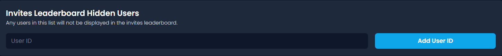

# 📊 Invite Tracking

##  Fake Delay

The _fake delay_ of your server is the number of days old an account has to be when joining to not be counted as a fake invite. For example, if you set your server's _fake delay_ to 5 days and an account that is 4 days old joins your server, the person who invited that account will gain a regular invite and a fake invite. The explanation of every invite type can be found [<mark style="color:purple;">here</mark>](join-join-dm-and-leave-messages/types.md#invite-types).


<mark style="color:blue;">Every server's default</mark> <mark style="color:blue;"></mark>_<mark style="color:blue;">fake delay</mark>_ <mark style="color:blue;"></mark><mark style="color:blue;">is 3 days.</mark>



<mark style="color:green;">A good</mark> <mark style="color:green;"></mark>_<mark style="color:green;">fake delay</mark>_ <mark style="color:green;"></mark><mark style="color:green;">is 5 days.</mark>



<mark style="color:orange;">A server's</mark> <mark style="color:orange;"></mark>_<mark style="color:orange;">fake delay</mark>_ <mark style="color:orange;"></mark><mark style="color:orange;">must be between 0 and 300 days.</mark>


## User Invites Blacklist

This is where you invite blacklist members using their user IDs. Invite-blacklisted users' invites are not tracked by Invite Tracker and they do not gain any invites. Welcome/leave messages are not affected by this.


<mark style="color:blue;">Information regarding how to get a user's ID can be found</mark> [<mark style="color:purple;">here</mark>](../../information.md#copying-a-user-id)<mark style="color:blue;">.</mark>



<mark style="color:orange;">Free servers can only have a maximum of 3 invite-blacklisted users.</mark>

<mark style="color:orange;">Premium servers can have a maximum amount of 100 invite-blacklisted users.</mark>



<mark style="color:red;">Be careful not to blacklist the wrong users.</mark>


## Invites Leaderboard Hidden Users

This is where you can hide users from the invites leaderboard using their user IDs. Invite leaderboard hidden users' invites are still tracked but not shown on the leaderboard.

<figure><figcaption></figcaption></figure>


<mark style="color:blue;">Information regarding how to get a user's ID can be found</mark> [<mark style="color:purple;">here</mark>](../../information.md#copying-a-user-id)<mark style="color:blue;">.</mark>


## Invite Label

Invite Labels allow you to label specific invite codes to track where members are joining from.

<figure><figcaption></figcaption></figure>

You can setup an invite label by pasting in your invite link or code (e.g discord.gg/someinvite or someinvite), and assign any text label you'd like.


<mark style="color:$success;">You can use the</mark> <mark style="color:$success;"></mark><mark style="color:$success;">`%invite_label%`</mark> <mark style="color:$success;"></mark><mark style="color:$success;">variable for your join, join DM, and leave messages so it will show the label name (or its invite code).</mark>&#x20;

<mark style="color:$success;">🌟 You can also search who joined from a specific label by using the</mark> <mark style="color:$success;"></mark><mark style="color:$success;">`/invitedlist`</mark> <mark style="color:$success;"></mark><mark style="color:$success;">command</mark>



<mark style="color:$warning;">Free servers can only have a maximum of 1 invite label.</mark>

<mark style="color:$warning;">Premium servers can have an unlimited amount of invite labels.</mark>



<mark style="color:$danger;">Invite Labels do not support custom invite links (vanity).</mark>

