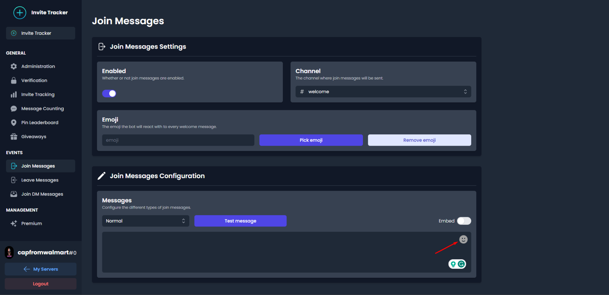
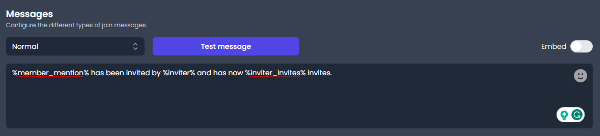
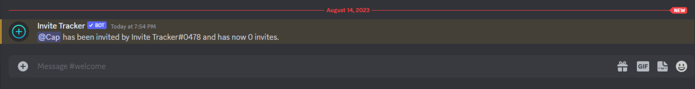
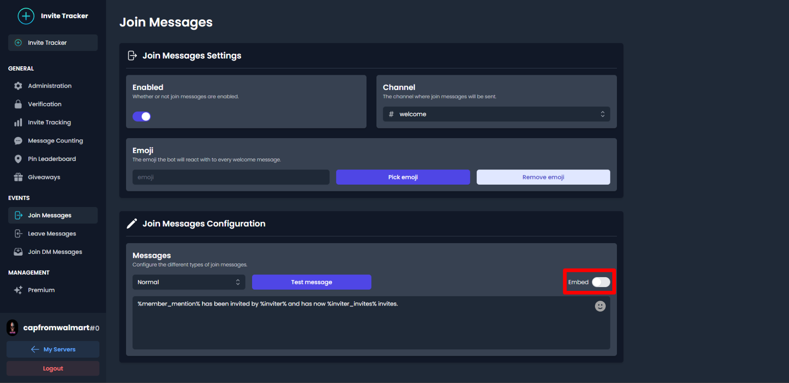
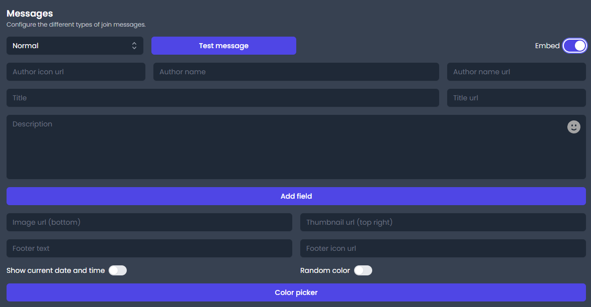
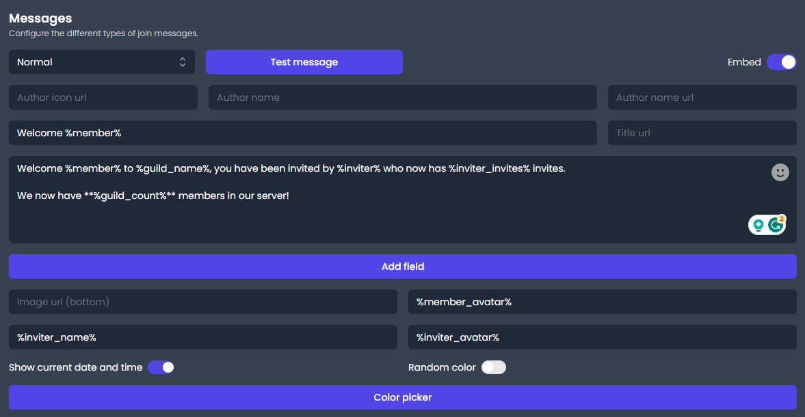

# 👋 Join, Join DM, and Leave Messages

## Useful Information

### Main Message Types

Join, join DM, and leave messages are very similar. The only differences are the triggers and the different variables you can use to configure them.&#x20;

For our examples, we will be configuring a join message.


<mark style="color:blue;">You can find an explanation of all the differences between the main message types</mark> [<mark style="color:purple;">here</mark>](types.md#main-message-types).


### Variables

Usually, you want the message to display information that changes its value depending on who just joined or who invited the person that just joined, for example. The way to add this type of varying information is by using variables.


<mark style="color:blue;">You can find the complete list of variables</mark> [<mark style="color:purple;">here</mark>](variables.md)<mark style="color:blue;">.</mark>


### Emojis

You can also set Invite Tracker to add an emoji reaction to every join message by clicking on the button that says _**Pick Emoji**_.

Lastly, you may use emojis for your message too. Adding emojis is simple. Just click the little smiley face in the top right corner of the black text box and select the emoji you are looking to add.

Take to mind that the only emojis that appear in the emoji keyboard are the ones from the server you are configuring the join message for. If you are looking to use emojis from other servers, please send the following message in any Discord server: `\:emoji name:`, it will replace the message with something that looks like this: `<:invitetracker:744565894289555456>`. If you take that message and put it into the dashboard, Invite Tracker will display the emoji when sending a message.


<mark style="color:orange;">There are two main problems with using custom emojis from other servers:</mark>

1. <mark style="color:orange;">You can not use emojis from servers that Invite Tracker is not in.</mark>
2. <mark style="color:orange;">There is a chance that the server removes either Invite Tracker or the emoji.</mark>


## Configuration

### Configuring a Channel

The first thing you would want to do is select the channel you want your message to be sent in.


<mark style="color:orange;">Configuring a channel does not apply to join DM messages.</mark>


### Configuring a Sub-Message Type

After you have chosen a channel, continue down to the **Messages** section of the page. You should see three boxes: one blue button, one small black box, and one large black text box. The first one is set to **Normal** by default, but you may change this if you are looking to edit another message type.

There is automatically a join message set by default that can be used as shown below.


&#x20;<mark style="color:blue;">A list explaining all the different sub-message types and their use can be found</mark> [<mark style="color:purple;">here</mark>](types.md#sub-message-types)<mark style="color:blue;">.</mark>


## The Message

### Creating the Message

When you have chosen the message type you want to configure, then you may pay attention to the large, black text box. This is where you write the message you want Invite Tracker to display when someone joins the server. The message may be anything you like.


<mark style="color:blue;">If you'd like to customize your own join message be sure to refer to the variables that can be found</mark> [<mark style="color:purple;">here</mark>](types.md#main-message-types)<mark style="color:blue;">.</mark>


### Testing the Message

After you have created your message, simply click the blue box named **Test message**. This will make Invite Tracker send a copy of the current message to either the configured join/leave channel or as a direct message to you, depending on what message type you have chosen.

The message will appear as you configured it. This message is an example of the default message set, you can go as crazy as you want with your join message. Your mind is your only limit.


<mark style="color:orange;">Remember to turn on join messages after finishing configuring your message by clicking the upper-most switch.</mark>


##  Embed

Embeds are a cool way to make _join_ and _leave messages_. Embeds bring a lot more customization to the table. You can configure anything from a 5-part story about a potato falling in love with a green rock, or you could configure the message to display all the variables, their function, and where to use them. Trust me, I have done it.

To enable and start configuring an embed, please click the switch right above the textbox at the right side of your screen labeled **Embed**.

After it has been enabled, you are prompted with a lot of text boxes. It might look like a lot, maybe even too much, but do not worry as everything will be explained.

An overview of where everything is placed in the embed can be found below.

.png>)

Now that you have a general idea of how the embed looks and what goes where we can get to the explanation of every textbox.

#### Author

* **Author Icon URL** is where you can put either a picture link or an avatar variable. It will display the image as a small profile picture in the top left corner of the embed.
* **Author Name** is just a regular textbox where you can add whatever you want. Take to mind that bold, italic, strikethrough or code fields do not work here.
* **Author Name URL** is where you can put either a picture link or an avatar variable. It will create a hyperlink on the author name content.

#### Title

* **Title** is just a regular textbox where you can add whatever you want.
* **Title URL** is where you can put either a picture link or an avatar variable. It will create a hyperlink on the title content.

#### **Content**

* **Description** is just a regular textbox where you can add whatever you want.
* **Add Field** adds more title and description textboxes.

#### **Pictures**

* **Image URL** is where you can put either a picture link or an avatar variable. It will display the image as a large picture at the bottom of the embed.
* **Thumbnail URL** is where you can put either a picture link or an avatar variable. It will display the image as a medium-sized picture at the top right of the embed.

#### Footer

* **Footer Text** is just a regular textbox where you can add whatever you want. Take to mind that bold, italic, strikethrough or code fields do not work here.
* **Footer Icon URL** is where you can put either a picture link or an avatar variable. It will display the image as a small profile picture in the top left corner of the embed.

#### Extra

* **Display Current Message Date** will show at what time the message was sent.
* **Color Picker** will change the colour of the embed line. Default is grey.
* **Random Color** will be a random embed color when the message is displayed.

Now, if we take everything we now know about embeds, we can make a simple embed message that looks like this:

Now if we click the **Test message** button, we get this message:

.png>)


<mark style="color:blue;">There is really no right or wrong way to use all the embed boxes, just play around with it until you find something you like.</mark>



<mark style="color:orange;">Pay attention to the small numbers under a few of the text boxes and buttons. They are the limits on how much can be fitted into that specific area.</mark>



<mark style="color:orange;">You can not use embeds for join DM messages.</mark>

