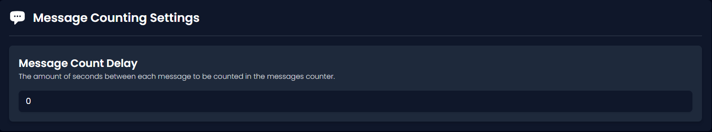
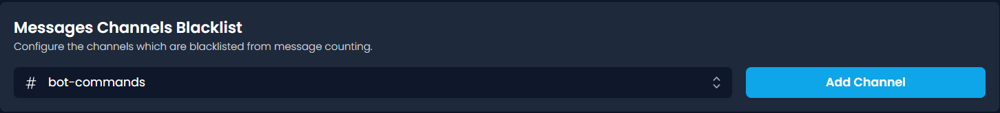
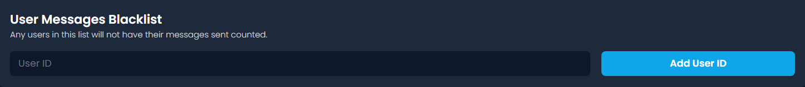
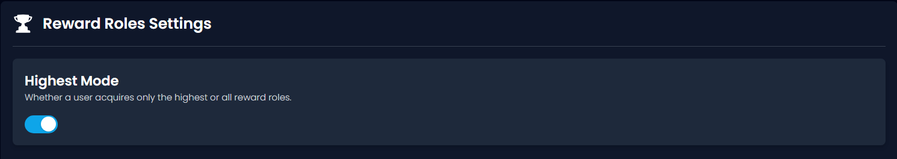
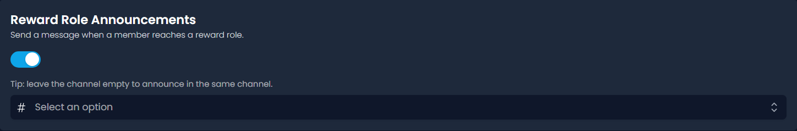
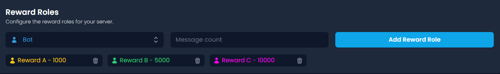

# 💬 Message Counting

## Message Count Delay

The _message count delay_ of your server is the number of seconds that need to pass between each counted message before Invite Tracker counts another message.&#x20;

For example, if a user sends a message which Invite Tracker counts and the _message count delay_ in that server is 10 seconds, Invite Tracker will not count any other messages sent by that same user before 10 seconds have passed. This is to stop people from spamming messages to be at the top of the message count leaderboard.


<mark style="color:$info;">Every server's default</mark> <mark style="color:$info;"></mark>_<mark style="color:$info;">message count delay</mark>_ <mark style="color:$info;"></mark><mark style="color:$info;">is 0 seconds.</mark>



<mark style="color:$success;">A good</mark> <mark style="color:$success;"></mark>_<mark style="color:$success;">message count delay</mark>_ <mark style="color:$success;"></mark><mark style="color:$success;">is 10 seconds.</mark>



<mark style="color:$warning;">A server's</mark> <mark style="color:$warning;"></mark>_<mark style="color:$warning;">message count delay</mark>_ <mark style="color:$warning;"></mark><mark style="color:$warning;">must be between 0 and 300 seconds.</mark>


## Messages Channels Blacklist

This is where you can blacklist a channel from having messages counted. Messages sent by users in a blacklisted channel will not be counted towards their total amount of messages sent.


<mark style="color:$success;">A good idea would be to blacklist any bot-designated channels. This is because usually, you do not want people to gain messages for spamming lots of commands.</mark>



<mark style="color:$warning;">Free servers can only have a maximum of 5 blacklisted channels.</mark>

<mark style="color:$warning;">Premium servers can have an unlimited amount of blacklisted channels.</mark>


## Role Messages Blacklist

This is where you can blacklist a role from having messages counted. Users with the selected role will not have their messages counted.

<figure><figcaption></figcaption></figure>


<mark style="color:$warning;">Free servers can only have a maximum of 3 blacklisted roles.</mark>

<mark style="color:$warning;">Premium servers can have an unlimited amount of blacklisted roles.</mark>


## User Messages Blacklist

This is where you can blacklist members from having their messages counted by using their user IDs. Messages sent by message-blacklisted users are not tracked by Invite Tracker and will not count towards their total amount of messages sent.


<mark style="color:$info;">Information regarding how to get a user's ID can be found</mark> [<mark style="color:$info;">here</mark>](../../information.md#copying-a-user-id)<mark style="color:blue;">.</mark>



<mark style="color:$warning;">Free servers can only have a maximum of 3 blacklisted users.</mark>

<mark style="color:$warning;">Premium servers can have an unlimited amount of blacklisted users.</mark>



<mark style="color:$danger;">Be careful not to blacklist the wrong users.</mark>


## Highest Mode

This switch decides the effect of the [_reward roles_](message-counting.md#reward-roles) feature for the message counting plugin.

_The Highest Mode_ decides whether users keep all of the reward roles they have managed to acquire or only the role that requires the most amount of messages. To keep the highest role, enable the Highest Mode setting. To keep all the roles added keep the Highest Mode setting disabled.

## Reward Role Announcements

_Reward Role Announcements_ allows the bot to send a message when the user reaches a reward role to the same channel or the selected channel.

<figure><figcaption></figcaption></figure>

## Reward Roles

A _reward role_ is a role that is assigned to a user when they have sent a certain amount of messages.


<mark style="color:$warning;">Free servers can only have a maximum of 5</mark> <mark style="color:$warning;"></mark>_<mark style="color:$warning;">reward roles</mark>_<mark style="color:$warning;">.</mark>

<mark style="color:$warning;">Premium servers can have an unlimited amount of</mark> <mark style="color:$warning;"></mark>_<mark style="color:$warning;">reward roles</mark>_<mark style="color:$warning;">.</mark>

