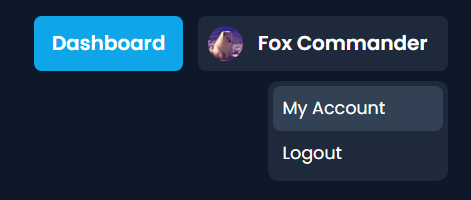
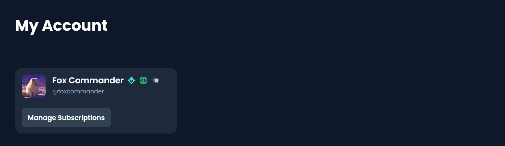
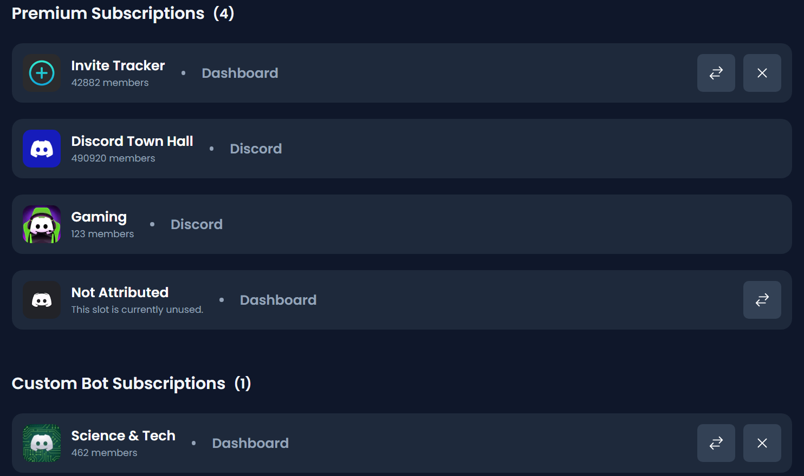

# 👤 My Account

_My Account_ will display at the top right when logged in. Click your username and you will have the options of _My Account_ and _Logout._

<figure><figcaption></figcaption></figure>

You will be presented with your avatar and username. The button to _Manage Subscriptions_ allows you to cancel your subscription, manage your payment information, and download your invoices.

<figure><figcaption></figcaption></figure>


The _Manage Subscriptions_ button will only work if you have a Dashboard subscription.

To cancel your Discord subscription, click [here](https://support.discord.com/hc/en-us/articles/26729692307351-How-to-Cancel-your-Premium-App-Subscription).


Below is a list of your current subscriptions and their platform. The sections are separated by tier if applicable. They also show which platform the subscription is from. The button with the **two arrows** allow you to move a subscription to another server with a selector. The button with an **X** allows you to remove the subscription from the selected server.

<figure><figcaption></figcaption></figure>


You can only move/remove subscriptions with the Dashboard platform. To move/remove subscriptions with the Discord platform, you need to cancel the subscription and resubscribe with the desired server. Click [here](https://support.discord.com/hc/en-us/articles/26729692307351-How-to-Cancel-your-Premium-App-Subscription) to find out how.

