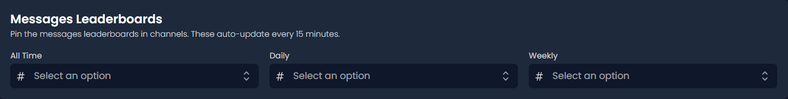

# 📌 Pin Leaderboard

##  Invite Leaderboard

This feature sends an automatically updating invite leaderboard to the selected channel.

<figure><figcaption></figcaption></figure>

After we press save, Invite Tracker will instantly create and pin an invite leaderboard in the specified channel.

##  Message Leaderboard

This feature sends an automatic updating message leaderboard to the selected channel.

<figure><figcaption></figcaption></figure>

After we press save, Invite Tracker will instantly create and pin an invite leaderboard in the specified channel.


<mark style="color:$success;">Daily/Weekly leaderboards show the previous 24 hours/week from the last 15 minute update.</mark>

