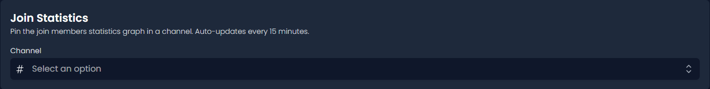

# 📊 Pin Statistics

##  Join Statistics

This feature sends an automatically updating join statistics embed to the selected channel.

<figure><figcaption></figcaption></figure>

##  Leave Statistics

This feature sends an automatically updating leave statistics embed to the selected channel.

<figure><figcaption></figcaption></figure>

##  Combined Statistics

This feature sends an automatically updating combined statistics embed to the selected channel.

<figure><figcaption></figcaption></figure>
