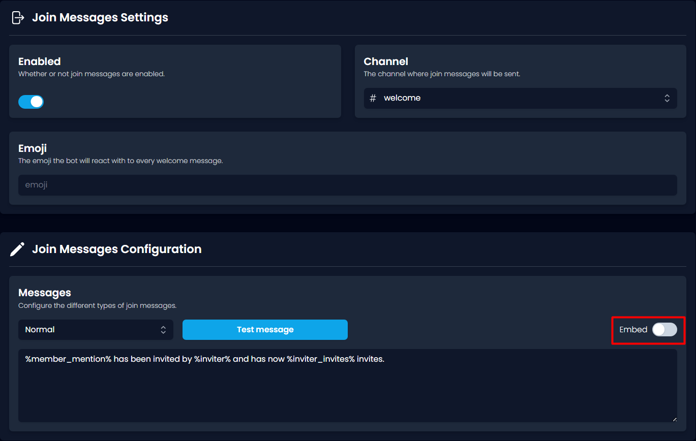

# Status

## Finding The Status Page

The Status page can be found either by accessing the [<mark style="color:purple;">dashboard</mark>](https://invite-tracker.com/) and clicking "Status" located at the top of the page, or you can simply just click this link:



## Using The Status Page

### Where's My Guild?

To find out which cluster your server is in, copy and paste your server's ID into the text box labelled "Guild ID". After clicking the blue button named "Calculate", the website should display which cluster and shard your server is located in.

.png>)

### Invite Tracker Status

Once you have the cluster and shard numbers, head down to the bottom part of the page. Here you will see a bunch of boxes with different numbers in them. Every box represents a cluster. Take the cluster number your server is located in and click the box with the same number. A menu should appear revealing all the shards located within that cluster. Then using the shard number that you got, locate your server's shard. From here you can check the ping of your server's shard.


<mark style="color:blue;">If a cluster is colored</mark> <mark style="color:green;">green</mark><mark style="color:blue;">, it means that the cluster is operational and has stable ping throughout all of the shards. Invite Tracker is fully functional.</mark>

<mark style="color:blue;">If a cluster is colored</mark> <mark style="color:yellow;">yellow</mark><mark style="color:blue;">, it means that the cluster has a partial outage with unstable ping in some of the shards. Invite Tracker may experience lag.</mark>

<mark style="color:blue;">If a cluster is colored</mark> <mark style="color:red;">red</mark><mark style="color:blue;">, it means that the cluster has a total outage with unstable ping in all of the shards. Invite Tracker is offline.</mark>

